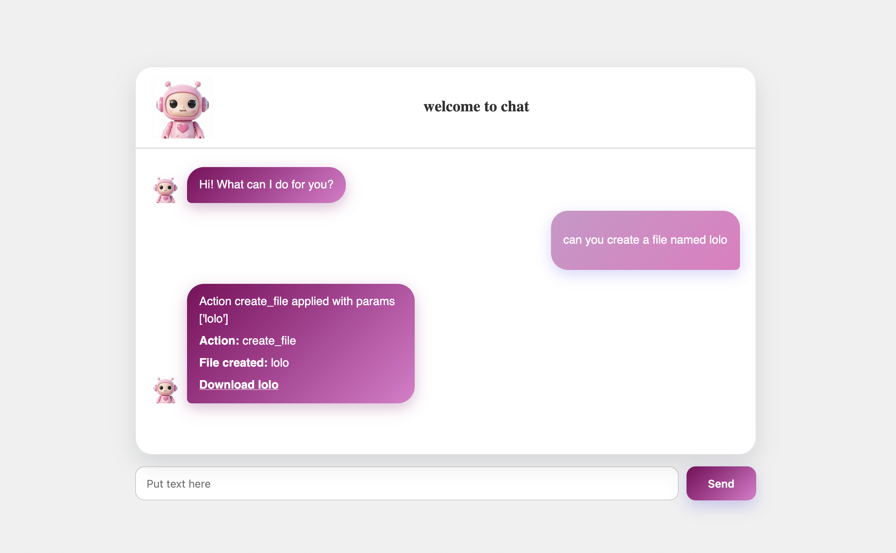

# Base Agent (Frontend + Backend + Agent + Ollama)

This project is a simple chat assistant that converts user requests into file actions.





## Architecture

- `frontend/`: Chat UI (HTML/CSS/JS)
- `backend/`: Orchestrator API (`/chat`) using the LLM prompt
- `agent/`: Action executor API (`/apply_action`) and local file actions
- `backend/config.py`: Single source of truth for model config + `SYSTEM_PROMPT`

Flow:
1. User sends text from frontend
2. Frontend calls `POST http://127.0.0.1:8001/chat`
3. Backend sends `system + user` messages to Ollama
4. LLM returns JSON action, for example:
   ```json
   {"action": "create_file", "params": ["maxime"]}
   ```
5. Backend forwards that JSON to `agent` (`POST /apply_action`)
6. Agent executes action via dispatcher (`agent.py` + `LIST_OF_ACTIONS`)

---

## Role of the LLM

The LLM does **decision-making**, not file manipulation directly.

- It reads the user request
- It maps intent to exactly one valid action + params
- It returns strict JSON
- The `agent` service performs the real action on disk

So:
- **LLM = planner / interpreter**
- **Agent = executor**

---

## Prerequisites

- Python environment already configured (venv)
- Dependencies installed from `requirements.txt`
- Ollama installed and available on `http://localhost:11434`
- A model pulled locally (example: `mistral:7b`)

Install dependencies:

```zsh
/Users/asmataberkokt/Downloads/base_agent/.venv/bin/python -m pip install -r /Users/asmataberkokt/Downloads/base_agent/requirements.txt
```

---

## Run services

Open separate terminals.

### 1) Agent API (port 8000)

```zsh
cd /Users/asmataberkokt/Downloads/base_agent/agent
/Users/asmataberkokt/Downloads/base_agent/.venv/bin/fastapi dev api-agent.py --port 8000
```

Check:

```zsh
curl http://127.0.0.1:8000/openapi.json
```

### 2) Backend API (port 8001)

```zsh
cd /Users/asmataberkokt/Downloads/base_agent/backend
/Users/asmataberkokt/Downloads/base_agent/.venv/bin/fastapi dev api.py --port 8001
```

### 3) Frontend

Open `frontend/index.html` (for example with Live Server).

---

## Test quickly

### Chat request

```zsh
curl -X POST "http://127.0.0.1:8001/chat" \
  -H "Content-Type: application/json" \
  -d '{"user_input": "can you create a file named maxime"}'
```

Expected response shape:

```json
{
  "status": "success",
  "response": "Action create_file applied with params ['maxime']",
  "action": {
    "action": "create_file",
    "params": ["maxime"]
  }
}
```

---

## Where created files appear

Files are created in the working directory of the running `agent` process.
If you started it from:

```zsh
cd /Users/asmataberkokt/Downloads/base_agent/agent
```

then `create_file("maxime")` creates:

- `/Users/asmataberkokt/Downloads/base_agent/agent/maxime`

---

## Important files

- `backend/config.py`: `SYSTEM_PROMPT`, model URL, model name
- `backend/api.py`: `/chat` endpoint, calls LLM, forwards action to agent
- `agent/api-agent.py`: `/apply_action` endpoint
- `agent/agent.py`: dispatcher `do()`
- `agent/actions/list_of_actions.py`: action registry
- `agent/actions/create_file.py`: file creation action
- `frontend/script.js`: chat rendering + loader behavior
- `frontend/fetchin.js`: backend request helper

---

## Troubleshooting

### `Address already in use`
A process is already running on that port.
Stop the old process or choose another port.

### `curl` Exit Code 7
Service is not reachable (usually not started or wrong port).

### `GET request cannot have a body`
Do not send body with GET endpoints in Swagger. Use POST for payloads.

### Ollama issues
- If `ollama serve` reports port already in use, Ollama is likely already running.
- Verify with:

```zsh
curl http://localhost:11434/api/tags
```
